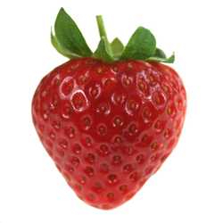
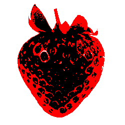
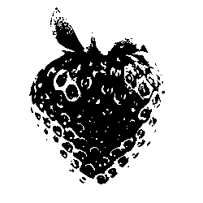
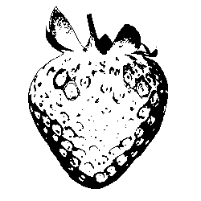
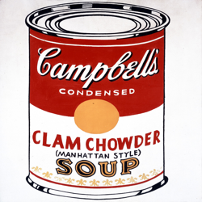
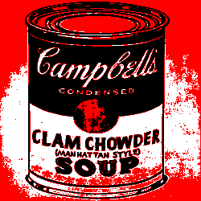
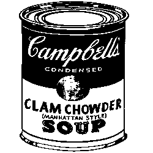

## Overview of Files:
#### ```html_scraper.py```:
This script directly accesses the url of the published Google doc embedded in the VML's website, and parses it using BeautifulSoup. It saves this as a python representation using the ```repr()``` function. The repr stored in "schedule.txt" is easily converted by python to a list upon reading the file.

#### ```display_image_processor.py```:
This script processes an image to be displayed next to the schedule hours. You have the option to process the image from a source locally, or to pull from a URL. The current URL is set to https://vml.pitt.edu/images/sign.png. 

All images are resized to be a square of 250x250 pixels, so be sure to use a square as input (or modify the code as needed) if it is important that the aspect ratio is preserved. Output images are represented either in black only, or both red and black. Dimensions of the input image are modifiable but it might be a bit tedious compared to modifying other parameters.

The script will automatically detect if the image is color or grayscale and process them accordingly. For color images, the image is converted to grayscale and reduced to 3 shades, which are then mapped to black, red, and white.  
In the rare case that the 3-color mapping results in 2 very close shades (which is often due to noise), the color image will be reproccessed and converted to 2 shades (black and white) instead. However, you can specify if you want the color image to be reduced to 2 colors (black and white only) manually as well. Black and red portions are stored as separate binary .bmp files.

Below is an example of the image processing on a color image. From top left to bottom right: the input image (resized), the reduced image, the black component, and the red component. <br>
 <br> 

An example that shows where automatic color reduction is valuable due to difficulties in discerning close shades of white:
   


#### ```display_refresher.py```:
This script puts all the pieces together and assembles an image, then refreshes the display. The text that was scraped is automatically sized to fit a specified screen dimension and margins.

**A brief overview of what occurs in this script is as follows:**
1. Specify Parameters
2. Read the schedule text
3. Create background PIL images; black and red pixels go on separate images as that is how the Waveshare display takes input
4. Determine header and body sizing/spacing using PIL bboxes. If the text is too big, shrink both the header and body.
5. Fill unused space by increasing size of body text without infringing on margins, and reserving a spot for the custom image
6. Render text and custom image on the PIL image
7. Send completed PIL image to the display and refresh the screen

**Some parameters to consider tweaking:**  
```MARGIN```: If the display's casing is changed in the future, you may want to edit the margin accordingly (or adjust for preference)  
```FONT_RATIO```: The minimum ratio of small font to big font. However, this is not a strict limit as the body font is programmed to fill as much empty space as possible, and can end up bigger than the header font ("big font" in the code)  
```IMAGE_BMP_DIR```: The directory with the .bmp images, which should be named appropriately by ```display_image_processor.py```. Do not put the path to the specific .bmp file.  
```MONOCOLOR_IMAGE```: If set to true, the displayed image will be a singular color. This monocolor image will be read from ```image_black.bmp``` regardless of whether you would like it to be displayed in red or black.  
```MONOCOLOR_BLACK```: If ```MONOCOLOR_IMAGE``` is set to True, then the value of ```MONOCOLOR_BLACK``` will determine whether the monocolor image is displayed in black (True) or red (False).